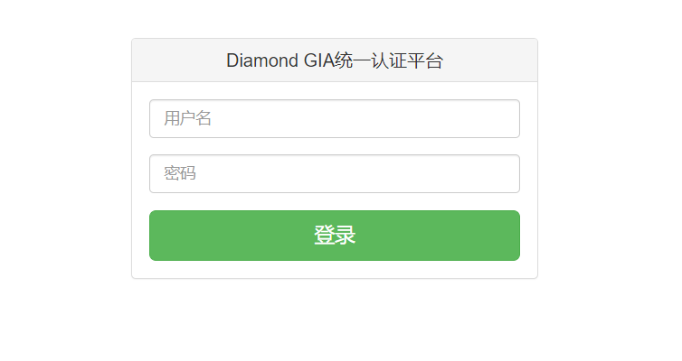
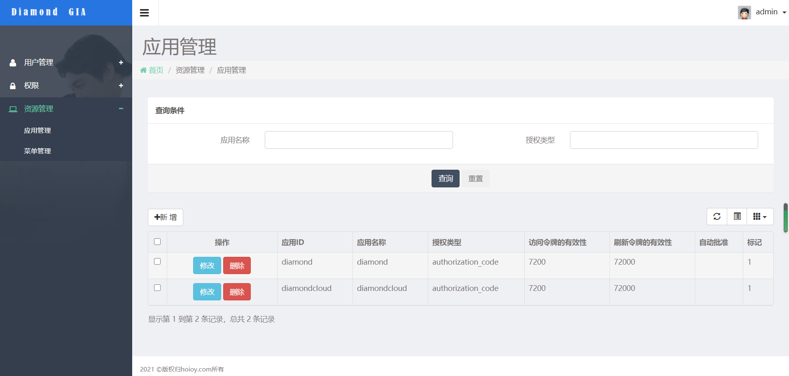

## Diamond GIA统一认证平台用户手册

### 登录页面

https://gia.diamond.hoioy.com/ 进入登录页面。

### Portal页面
门户页面包含用户可以看到的所有对接使用hoioy一统一认证的客户端应用。

点击各个应用跳转到各自的主页。

### 应用管理
在门户页点击·应用管理·进入后台管理页面，只有系统管理员才有权限进入这个页面。

应用管理tab页可以对应用进行增删改查的操作。

点击新增或者修改都会弹出应用编辑的对话框

点击·输入字段说明·查看具体每个字段的意思。

### 应用权限配置
可以配置不同的角色是否可以看到不同的应用。点击·应用权限管理·tab页进行具体编辑

### 自有用户
统一认证中心对接了公司LDAP用户，也支持自有用户编辑。点击·所有用户·tab页对用户进行编辑

可以使用自有用户登录，自由分配角色。如果自有用户与LDAP用户名冲突，以LDAP用户为准。

### 关于客户端对接
博客介绍: http://tech.hoioy.com/#/blog/view/7eb7cba83b6b4dc38216dda46057e4e8
源码地址: https://gitlab.hoioy.com/IRI/diamond-auth/diamond-gia